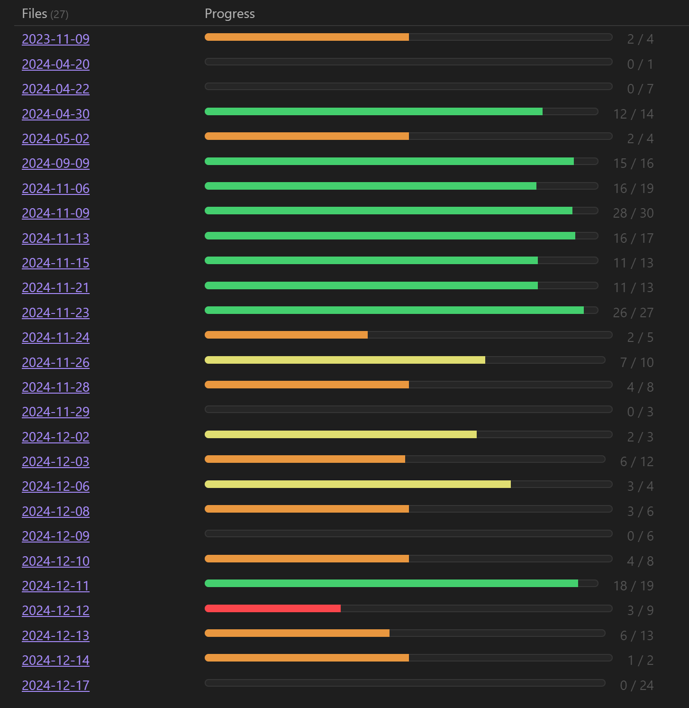

# obsidian-dataview-progress-in-tasks

This script for the Dataview plugin in Obsidian visualize task progress from specified folder. It creates a table showing task completion status with an interactive progress bar for each file.



Please specify the folder to track by modifying the path in the script.

## Installation

1. Copy the script into your Obsidian vault.
2. Replace `"relative/path/to/your/folder"` with the path to your target folder.
3. Add the script to a Dataview block in your Obsidian note.

To show notes with fully completed tasks, use the updated condition below to ensure all tasks are considered, including fully completed ones:

Replace this line:

```dataview
WHERE length(rows) > length(filter(rows.tasks, (r) => r.completed))
```

With this line:

```dataview
WHERE length(rows) >= length(filter(rows.tasks, (r) => r.completed))
```
